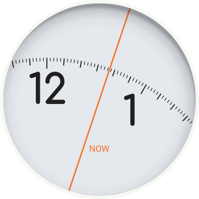
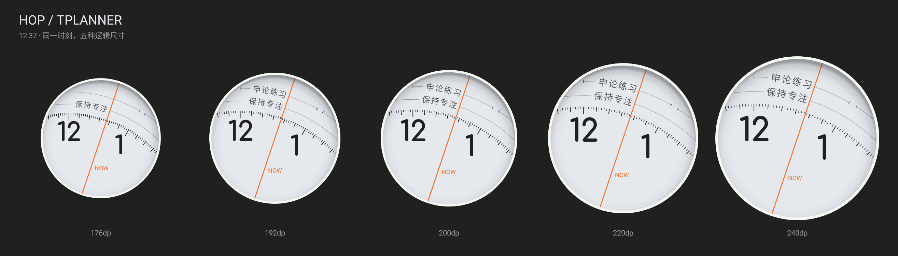
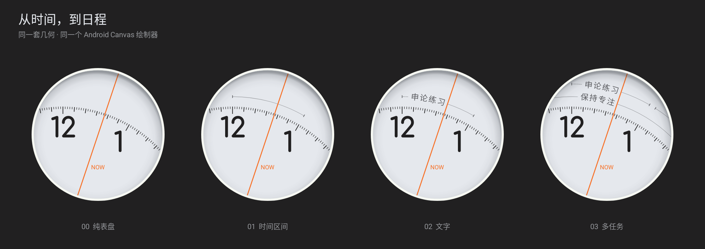
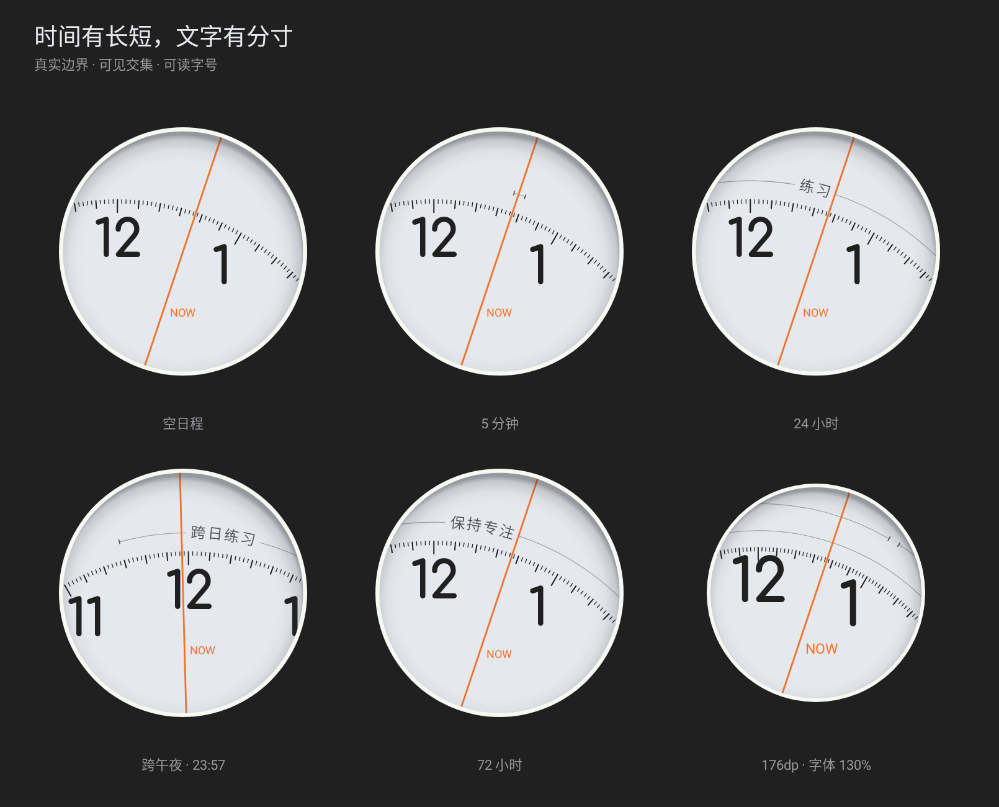

# Hop / 跃时

Hop is a third Wear face. `FaceHop` consumes the same committed `WatchEventMarks.items`
projection as Tide and Next, including pending local creations and deletions. Empty data
produces the plain dial. All schedule content in the checked-in previews is test data.

## Visual baseline and reference limits

The current surface reference is the user's watch photograph in
[`design-assets/hop/reference.png`](../design-assets/hop/reference.png). Its cool dial color,
bright outer lip and directional inner shadow replace the earlier flat cream baseline.
The 12:37 render below retains the moving geometry and task behavior while matching those
surface details. It is not a pixel-perfect reconstruction of a perspective photograph.



Primary research identified [Grégoire Sage's Pebble implementation](https://github.com/gregoiresage/hop-picker),
linked by the [Pebble app store](https://apps.repebble.com/hop-picker-watch_52f2c9ddab54ff806f000088).
Its screenshots and geometry establish an upright numeral ring and a virtual center that
travels around the viewport. NOW's position on the numeral ring stays at screen center;
the hand's **orientation changes with time**. The supplied text's suggestion of a fixed
hand angle is not how this early reference behaves. Android code here independently
implements the geometry; no Pebble implementation or image assets are embedded.

The photograph is the source of truth for the surface treatment. The early Pebble
implementation remains only a motion/geometry reference; its dark theme is not used.

### Color-picker samples and recessed edge

Coordinates below are from the unmodified 385 × 357 reference image, origin at top left;
patch right/bottom bounds are exclusive. Medians avoid individual noisy/antialiased pixels.

| Surface | Sample bounds | Sampled sRGB |
| --- | --- | --- |
| Unprinted dial, left | `(157,179)–(170,192)` | `#E5E8ED` |
| Unprinted dial, right | `(211,174)–(224,187)` | `#E5E8ED` |
| Lower dial | `(185,213)–(198,226)` | `#E4E7EC` |
| Bright outer lip | `(99,171)–(102,182)` | `#F6F8F2` |
| Top inner shadow | `(186,84)–(201,87)` | `#96989C` |
| Numeral stem | `(153,145)–(156,160)` | `#212021` |
| Orange line, high-chroma core pixels | Full-line top-chroma quartile, 78 pixels | `#F77128` |

Paper, rim, ink and orange tokens use these sampled values. Task text remains a secondary
cool gray. The photograph includes real lighting/glass/camera processing, so these are
image-matching values rather than calibrated material colors.

A fixed `max(2.5dp, 0.016D)` white lip surrounds the inner aperture. All moving content is
clipped inside it. A cached radial gradient, offset slightly left and downward, casts a
soft inner shadow strongest at top/right and faintest at the lower-left edge. Its transparent
center preserves the sampled base color. The shadow overlays the dial without moving with
the virtual center. Ambient omits both the bright lip and the shadow. This uses no blur
filter, raster texture, new animation loop or image asset inside the production face.

The interactive orange hand spans the entire inner aperture, clipped before the white lip
at both ends. The NOW caption sits beside it. Task labels move to the nearest readable
side of the hand, or disappear if neither side fits; the hand remains continuous. Ambient
keeps its shorter, dim hand.

## Parameters

`HopFaceMetrics` is the sole source of physical geometry. Let `D` be the logical short
edge, converted to pixels using display density:

| Parameter | Baseline | Constraint |
| --- | --- | --- |
| Virtual center orbit | `5D / 6` | Independent of tasks and font scale |
| Hour numeral radius | `5D / 6` | NOW point remains at screen center |
| Tick radius | `D` | Same center as numerals and tasks |
| First task radius | `1.075D` | Second lane uses measured font height + 5dp |
| Stationary white lip | `max(2.5dp, 0.016D)` | Content clips to the inner aperture |
| Aperture safe inset | `max(4dp, 0.015D)` | Measured text height further insets label window |
| Hour typography | `clamp(40 × D/200, 36, 46)sp` | Comfortaa Bold; independently sourced OFL font |
| Task typography | `clamp(12 × D/200, 11, 14)sp` | Respects system font scale, never shrunk to fit |
| Task tracking | `0–0.12em` | Only simple CJK/kana; other scripts keep shaping |
| Minor / major ticks | `0.65 / 1dp` | 2-minute cadence, longer every 10 minutes |
| Task / NOW strokes | `0.55 / 1.4dp` | Duration never changes weight |
| Interactive refresh | 1 second | No continuous animation loop |

The larger hour type reflects the observed oversized reference dial, rather than treating
the conversation's illustrative 27sp suggestion as a measured specification. Palette values
and semantic font sizes live in the shared design tokens. Task typography cannot move the
hour ring. At large font scales the second lane is removed if its measured height cannot fit.

## Time, space and labels

All tasks use absolute epoch milliseconds and half-open `[start, end)` intervals. Only the
intersection with the visible circle is mapped to angles. There is no modulo-day mapping
for tasks; a 72-hour task and a 24-hour task covering the same viewport render identically.
Zero-duration events become single ticks, without invented duration. Caps represent only
real endpoints inside the visible window.

The geometric window comes from the intersection of the virtual track circle and the
inner aperture circle. Each lane has its own window. The readable window is separately inset by
font ascent/descent and edge padding. Labels keep their true temporal midpoint whenever it
fits; both-ends-offscreen labels use the readable center. Text moves with the same virtual
center as the ticks. Text below the dial reverses its reading path to remain upright.

Titles do not fill time intervals: measured text occupies its natural length, modest CJK
tracking stops at 0.12em, and the remaining duration is a hairline. Insufficient space
produces a grapheme-safe ellipsis, or only interval marks. Latin kerning, Arabic shaping,
emoji modifiers and joiners are preserved. Overlap admission prefers shorter tasks over
long spans, then assigns deterministic chronological lanes. At most two lanes render;
additional overlapping tasks remain accessible by tapping into the Wear app.

Ambient mode uses a black background, sparse dim hour ticks, numerals and hand, with no
task layer. Low-bit ambient disables antialiasing. Burn-in protection shifts lit content
by a small minute-dependent offset.

## Review and reproduce







```powershell
.\gradlew.bat :wear:assembleDebug :wear:lintDebug
pwsh scripts/check-android-brand-assets.ps1
```

Update the checked-in preview PNGs when the painter changes. Vendor font fallback,
picker discovery, round screen insets, live projection updates and tap behavior need
verification on a connected watch.

The new face follows the repository's existing Canvas watchface service integration and
inherits its platform support limits. It is not a migration to Watch Face Format.

## Font provenance

Comfortaa is independently bundled from [Google Fonts](https://github.com/google/fonts/tree/main/ofl/comfortaa).
Its SIL Open Font License ships inside the APK at `assets/licenses/Comfortaa-OFL.txt`.
Font SHA-256: `0fc3f45dc48b614db9c39181502544b37217ecbf8bee2fb35886992bc96c5bd3`.
